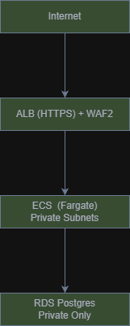

# Terraform Infrastructure — ECS + RDS + ALB + WAF
## Overview

This Terraform project provisions a secure AWS infrastructure for a Next.js application running on:

- ECS Fargate

- RDS (PostgreSQL)

- Application Load Balancer (ALB)

- AWS WAFv2

- AWS Secrets Manager

- VPC with public/private subnets

### The design prioritizes:

- Network isolation

- Least privilege access

- HTTPS by default

- Managed security controls

- CI validation gates

## Architecture Diagram



## Networking Design
### VPC

- Dedicated VPC per environment

- CIDR configurable via tfvars

### Subnets

- Public subnets

  - ALB

  - NAT Gateway

- Private subnets

  - ECS tasks

  - RDS database

### Routing

- Public → Internet Gateway

- Private → NAT Gateway (egress only)

### Security Intent

- RDS is never publicly accessible

- ECS tasks are not exposed directly

- Only ALB receives internet traffic

## Security Design Decisions
### HTTPS by Default

- ALB listener on 443

- ACM certificate required

- HTTP (80) redirects → HTTPS

- TLS policy enforced

Reason:

- Encryption in transit

- Modern TLS standard enforcement

### Web Application Firewall (WAFv2)

- Enabled with AWS Managed Rule Sets:

- AWSManagedRulesCommonRuleSet

- AWSManagedRulesKnownBadInputsRuleSet

- Optional: Rate limiting rule

Security Intent:

- Mitigate OWASP Top 10

- Block common exploit payloads

- Protect from basic abuse patterns

- Enable CloudWatch metrics visibility

### Secrets Management

Sensitive DB values stored in:
- AWS Secret Manager

Stored keys:

- DB_HOST

- DB_NAME

- DB_PASSWORD

- DB_PORT

Injected into ECS via:

``` secrets = [
  { name = "DB_HOST", valueFrom = "...:DB_HOST::" }
]
```
Security Intent:

- No secrets in Terraform state outputs

- No secrets in Docker image

- No secrets in GitHub Actions

- No secrets in .env for production

## IAM Least Privilege

### ECS Execution Role

- Pull image

- Write logs

- Read specific secret ARN

### ECS Task Role

- Application-level permissions only

- No wildcard privileges

### Container Security

CI Pipeline Enforces:

- Hadolint (Dockerfile best practices)

- Trivy image scan (HIGH/CRITICAL fail)

- Trivy FS

- Gitleaks (secret scanning)

Security Intent:

- Shift-left vulnerability detection

- Prevent insecure image promotion

### Database Security

- Private subnets only

- Security group allows inbound only from ECS SG

- Storage encrypted

- No public access

- Randomly generated password

## Module Structure

```
terraform/
  modules/
    vpc/
    security/
    rds/
    secrets/
    alb/
    ecs/
    waf/
```

### Module Responsibilities

| Module   | Responsibility |
|----------|---------------|
| vpc      | Networking, subnets, NAT |
| security | Security groups |
| rds      | PostgreSQL instance |
| ecs      | ECS cluster and service |
| alb      | Load balancer + HTTPS |
| waf      | Web Application Firewall |

## CI/CD Quality Gates

The pipeline enforces:

### Terraform

- terraform fmt

- terraform validate

- tflint

- checkov

### Docker

- Hadolint

- Trivy image scan

### App

- Trivy fs

- Gitleaks

- Integration Test:

- docker compose up

- Health check /api/db-check

## Configuration

Example terraform.tfvars:

```
app_name = "my-app"
env      = "dev"

image_uri = "ghcr.io/org/app:abc123"

db_name = "appdb"
db_user = "appuser"

enable_https = true
enable_waf   = true
```

### Observability

- ALB metrics in CloudWatch

- WAF metrics enabled

- ECS logs in CloudWatch Log Group

- RDS logs configurable

### Security Posture Summary

| Control              | Status |
| -------------------- | ------ |
| Network Isolation    | ✅      |
| Encrypted in Transit | ✅      |
| Encrypted at Rest    | ✅      |
| Secrets Externalized | ✅      |
| WAF Protection       | ✅      |
| Container Scanning   | ✅      |
| IaC Scanning         | ✅      |
| Git Secret Detection | ✅      |

### Proof of work can be found on the action tab as the docker-compose test passess and the security scans failed because they found issues.
